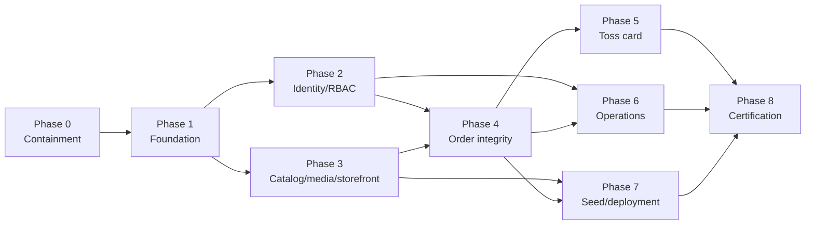

# NOEUL production remediation and implementation plan

Date: 2026-09-18  
Source audit: [PROJECT_AUDIT.md](./PROJECT_AUDIT.md)  
Status: security-reviewed target architecture; not approved for production until every release gate in this document has evidence  
Scope: close all 25 audit finding groups and replace the prototype data/auth/payment paths with a production backend and reference-informed storefront.

Architecture/safety review: [PLAN_ARCHITECTURE_REVIEW.md](./PLAN_ARCHITECTURE_REVIEW.md)

## 1. Goal and accepted decisions

NOEUL will become a production-ready Korean fashion storefront with verified identity, backend-authoritative commerce data, safe order/payment processing, durable storage, responsive product discovery, repeatable tests, observable operations, and a controlled release process.

The following decisions are locked:

1. **Identity:** Google is the only customer and staff login provider, implemented through Supabase Auth.
2. **Checkout:** customers must sign in before checkout. Guest checkout is not supported.
3. **Payments:** Toss card is the only v1 payment method. No manual bank transfer, virtual account, or receipt-upload workflow.
4. **Managed platform:** Supabase Postgres, Auth, and Storage.
5. **Authority:** the Node API is the only business-data access layer. Browsers do not read/write Supabase tables or RPCs and do not upload directly to public Storage. They may complete the controlled Auth redirect and fetch published immutable product-media renditions from the public CDN/Storage endpoint.
6. **Source data:** existing SQLite/Supabase/Firestore records are test data. Approved catalog/content/settings/media will become deterministic seed data; test identities, credentials, customer records, orders, receipts, and payment history will not enter production.
7. **Storefront direction:** adopt useful interaction patterns from the public Locker Room storefront—without copying its branding, content, images, or proprietary code—including curated collections, swipeable/timed product media, variant-driven imagery, product-detail galleries, and mobile purchase controls.
8. **Initial region:** Korea/KRW is the working v1 assumption and must be confirmed before production launch.
9. **Public topology:** use one public site origin where possible (`https://<store-domain>/api/v1` reverse-proxied to the API). If an API subdomain is unavoidable, it must remain same-site, use an exact CORS allowlist, and never use wildcard credentialed CORS.
10. **Deployment default:** Vercel may host the Vite frontend; a container-capable host runs separately scalable API and worker processes. The selected host must support health checks, rolling deploys, secret management, outbound allowlisting where available, scheduled work, and zero reliance on local disk. Supabase remains the durable data/storage/auth platform.
11. **Database change authority:** versioned Supabase CLI SQL migrations are the sole schema-migration authority. Drizzle is the typed query layer; ORM auto-sync/auto-migrate is forbidden in staging and production.
12. **Delivery semantics:** asynchronous work is at-least-once and idempotent. The plan does not claim exactly-once network delivery.

Security containment precedes feature development. Online Toss payments remain disabled in production until their complete sandbox, replay, reconciliation, and refund gates pass.

## 2. Target architecture

Use a modular monolith rather than microservices:

```text
React/Vite storefront + admin
            |
      HTTPS /api/v1
            |
 Node.js TypeScript API
 - Supabase Auth session boundary
 - catalog/CMS/media
 - cart/pricing/checkout
 - orders/inventory/coupons
 - Toss Payments
 - admin/RBAC/audit
            |
 Supabase Postgres + Supabase Storage
            |
 Background worker
 - transactional outbox
 - notifications
 - reservation expiry
 - Toss reconciliation
 - image renditions
```

Implementation defaults:

- supported Node.js LTS and TypeScript;
- Express 5 for the least disruptive migration, with Zod contracts and generated OpenAPI;
- Supabase CLI SQL migrations as the sole migration path, with Drizzle for typed parameterized queries over the appropriate pooled PostgreSQL connection;
- Supabase Auth authorization-code/PKCE flow, verified through asymmetric signing keys/JWKS or the supported claims API;
- opaque server-managed sessions in a host-only `__Host-noeul_session` cookie (`HttpOnly`, `Secure`, `SameSite=Lax`, `Path=/`) rather than browser `localStorage` tokens;
- Supabase Storage with public/CDN product-media delivery and private operational buckets;
- transactional outbox and idempotent workers with leases, bounded exponential backoff, dead-letter handling, and replay tooling; Redis only if measured distributed coordination needs justify it;
- structured logs, request IDs, error tracking, metrics, audit logs, and alerts.

### Supabase responsibility boundary

- **Auth:** Google identity and provider session lifecycle.
- **Postgres:** sole authoritative application database.
- **Storage:** catalog/content media and any private operational artifacts.
- **Node API:** all commerce, content-management, customer, and administrative decisions.
- **Worker:** asynchronous effects, retries, expiry, media processing, and reconciliation.

Keep Row Level Security enabled and deny browser roles by default as defense in depth. Revoke `anon` and `authenticated` grants on private business schemas. Ordinary API queries use a dedicated least-privilege, non-owner, non-`BYPASSRLS` database role over TLS; migration and runtime credentials are separate. A Supabase secret/service-role key, if required for narrowly scoped Auth/Storage administration, uses a separate client, exists only in the server secret manager, and never handles ordinary commerce queries or appears in Vite variables, logs, CI artifacts, or browser code.

Production enables Supabase SSL enforcement, database network restrictions compatible with the chosen host, organization MFA, Security Advisor review, connection/pool monitoring, and sufficient connection headroom for Supabase services, API replicas, workers, migrations, and incident access.

## 3. Trust boundaries and invariants

1. The client sends intent—not trusted price, discount, stock, shipping, role, ownership, order status, or payment results.
2. Identity and ownership derive only from a verified backend session. Never trust request `user_id`, Firebase UID, email, or role fields.
3. Only a successful server-side Toss confirm/query result may move a payment to `paid`.
4. Webhook deliveries are recorded, deduplicated, revalidated against Toss, and processed idempotently.
5. Order, payment, inventory, coupon, cancellation, and refund changes use explicit state machines and database transactions.
6. Retriable business writes use idempotency keys backed by unique database constraints.
7. Add-to-cart accepts only `variant_id` and quantity; the backend revalidates publication, variant, price, stock, and purchase limits.
8. No runtime database, credential, receipt, export, or user upload is committed to Git or stored on an ephemeral application disk.
9. Only `toss_card` is accepted in v1; every other method is rejected at the API boundary.
10. There is no guest-order access path.
11. No NOEUL component collects, stores, logs, or proxies PAN, CVV, or raw card-entry fields; the Toss-hosted widget owns card-data entry.
12. Public product media is generated from quarantined uploads; untrusted originals are never served from the storefront origin.
13. Logs, traces, analytics, support tools, and error reports must redact tokens, cookies, authorization headers, payment keys, addresses, phone numbers, and unnecessary provider payloads.
14. Production data never enters developer laptops, previews, automated tests, or lower environments; sanitized factories and approved seeds are used instead.

## 4. Backend domains and data model

Organize the API by domain:

- identity, profiles, sessions, addresses, staff, roles, and permissions;
- categories, collections, products, options, variants, prices, badges, and media;
- inventory ledger and reservations;
- authenticated carts, wishlists, recently viewed, and promotions;
- checkout quotes, orders, order history, and cancellation/returns;
- Toss payment attempts, events, refunds, and reconciliation;
- shipments and tracking;
- reviews, Q&A, and inquiries;
- pages, menus, banners, homepage sections, settings, and translations;
- notifications, outbox, jobs, idempotency, audit logs, and health checks.

### Core tables

| Group | Main tables |
|---|---|
| Identity/privacy | Supabase `auth.users`; application `profiles`, `sessions`, `addresses`, `staff_members`, `staff_roles`, `role_permissions`, `consent_records`, `privacy_requests`, `retention_holds` |
| Catalog | `categories`, `collections`, `collection_products`, `products`, `product_options`, `option_values`, `product_variants`, `product_media`, `media_renditions`, `prices`, `product_badges` |
| Inventory | `inventory_items`, `inventory_ledger`, `inventory_reservations` |
| Shopping | `carts`, `cart_items`, `wishlists`, `recently_viewed_products`, `coupons`, `coupon_reservations`, `coupon_redemptions` |
| Orders | `orders`, `order_items`, `order_status_history`, `shipments`, `shipment_events` |
| Payments | `payment_attempts`, `payment_events`, `refunds`, `webhook_events` |
| Content/support | `reviews`, `questions`, `inquiries`, `pages`, `banners`, `menus`, `homepage_sections`, `site_settings`, `media` |
| Reliability | `idempotency_keys`, `outbox_events`, `job_attempts`, `audit_logs` |

Required constraints include:

- one application profile per Supabase user UUID;
- unique SKU per exact variant;
- unique Toss payment key/provider transaction and unique webhook identity where available;
- unique idempotency key per principal and operation;
- positive integer quantities and non-negative monetary values;
- append-only inventory ledger and conditional reservation updates;
- valid order/payment transition checks;
- UTC timestamps presented in store/user timezone;
- immutable order-line snapshots of product, variant, SKU, price, discount, tax/shipping, and name.
- money stored as integer KRW with database checks; no floating-point money arithmetic;
- foreign keys use explicit deletion behavior; financial/audit history is never cascade-deleted accidentally;
- normalized, case-insensitive unique slugs/SKUs where appropriate and deterministic pagination tie-breakers;
- encrypted refresh-token/session material and sensitive operational values use envelope encryption with a versioned key identifier.

### Variant and media model

- `product_variants`: product, SKU, color, size, optional price delta, status, display order, weight, inventory item, and publication dates.
- `option_values`: localized label, machine slug, named swatch color/image, display order, and enabled state.
- `product_media`: product, optional color/exact-variant association, storage key, role, order, localized alt text, dimensions/aspect ratio, MIME type, blur placeholder, publication state, and card-autoplay eligibility.
- `media_renditions`: source media, format, width, storage key, checksum, and byte size.
- A database check prevents media from referencing another product's variant.
- At most one primary media item exists per product/variant scope.
- Shared fallback order: exact-variant media, color media, product media, intentional placeholder.

## 5. API contract

Use `/api/v1`, schema validation, consistent error envelopes, pagination, request IDs, and generated OpenAPI.

### Public/storefront

- `GET /catalog/products`, `GET /catalog/products/:slug`
- `GET /catalog/categories`, `GET /catalog/collections/:slug`
- `GET /content/home`, `GET /content/menu`, `GET /content/pages/:slug`
- `GET /store/settings/public`
- `GET /products/:id/reviews`, `GET /products/:id/questions`

Catalog lists return compact card media, swatches, price range, badges, review summary, and availability. Product detail returns the option/variant matrix and grouped media needed for deterministic variant switching.

### Identity/customer

- `GET /auth/google/start`, `GET /auth/google/callback`
- `POST /auth/logout`, `POST /auth/logout-all`
- `GET /me`, `PATCH /me`, `DELETE /me`
- `GET|POST|PATCH|DELETE /me/addresses`
- `GET|PUT|DELETE /me/wishlist/:productId`
- `GET|PUT /me/recently-viewed`
- authenticated review, question, and inquiry endpoints

### Cart/checkout/orders

- `GET /cart`, `POST /cart/items`, `PATCH|DELETE /cart/items/:id`
- `POST /checkout/quote`
- `POST /orders` with `Idempotency-Key`
- `GET /orders`, `GET /orders/:publicId`
- `POST /orders/:publicId/cancel`

### Toss Payments

- `POST /payments/toss/prepare`
- `POST /payments/toss/confirm`
- `POST /payments/toss/webhook`
- `POST /admin/payments/:id/refunds` with idempotency

### Admin

- CRUD for catalog variants, categories, collections, media, content, coupons, settings, reviews, Q&A, and staff;
- command endpoints for order/payment/refund/shipment transitions—never unrestricted status-field patches;
- drag/order media; assign to product/color/variant; select primary/card/detail roles; edit alt text; preview card autoplay/variant switching;
- curate home sections, campaigns, badges, same-day dispatch, and related products;
- view audit/reconciliation data with permission checks.

## 6. Google-only Supabase authentication

1. Browser requests `/auth/google/start` from the Node API.
2. The API starts Supabase Auth's Google authorization-code/PKCE flow and stores single-use, high-entropy state/nonce/PKCE material server-side with a short expiry and an opaque correlation cookie.
3. Only allowlisted staging/production callbacks are accepted.
4. The backend exchanges the single-use code, validates the Supabase identity, and upserts `profiles` by `auth.users.id`.
5. The backend stores Supabase access/refresh material encrypted in the server-side session record and gives the browser only a random opaque session ID in `__Host-noeul_session`. Tokens are not persisted in browser storage or readable cookies.
6. `/me` is the only restored browser identity source.
7. Session refresh is serialized per session so refresh-token rotation cannot race across requests. Session IDs rotate after login, privilege/MFA changes, and suspicious events.
8. Normal requests verify expiry/signature/issuer/audience and session state. Refunds, staff/role changes, address exposure, account deletion, and other high-risk operations also perform a fresh provider/user check and require recent authentication.
9. Sign-out revokes the server session and clears the cookie; global sign-out revokes every application session and the corresponding Supabase sessions as supported.

Every state-changing cookie-authenticated request must pass an exact `Origin`/`Referer` check and a synchronizer or signed double-submit CSRF token sent in a custom header. GET/HEAD/OPTIONS are side-effect free. CORS is denied by default; if enabled for a same-site API subdomain, allow only named production/staging origins, required methods/headers, and credentials.

Disable password, magic-link, phone, anonymous, and every other social provider. Require a verified Google email, but use the Supabase UUID—not email—as ownership identity.

Staff also use Google. A valid identity grants no staff rights without an active `staff_members` allowlist row and server permissions. Require Supabase MFA assurance level 2 and recent step-up for staff management, refunds, exports, secrets/settings, and destructive operations. Domain membership alone is never authorization. Revoking staff access invalidates all of that user's application sessions immediately.

Suggested permissions:

| Role | Allowed scope |
|---|---|
| `super_admin` | staff/security management plus all operations |
| `admin` | catalog, orders, customers, CMS, settings; no super-admin management |
| `order_manager` | orders, payments, refunds, and shipment operations only |
| `editor` | catalog and CMS only |

Prevent self-demotion/deletion, deletion of the final super-admin, and privilege changes without audit records/session revocation.

## 7. Toss card design

### Payment sequence

1. Authenticated checkout obtains a short-lived backend quote.
2. An idempotent order transaction validates price/variants/coupon/shipping, reserves inventory/coupon use, creates a `pending_payment` order, and creates a random compliant Toss order ID.
3. The browser renders the Toss v2 widget configured for card only and requests the exact stored amount.
4. The success redirect posts returned `paymentKey`, `orderId`, and `amount` to the API.
5. The backend locks the attempt, compares stored order/amount/currency, and calls Toss `POST /v1/payments/confirm` with the secret key.
6. The confirm call carries a persisted random provider idempotency key. A valid response is recorded and changes payment/order/inventory state transactionally. Duplicate client confirms return the stored result and never create a second provider operation.
7. `PAYMENT_STATUS_CHANGED` is treated as an untrusted notification: enforce body/time/rate limits, record the transmission identifier/raw hash, deduplicate, then query Toss with server credentials before applying any state. General payment webhooks are not assumed to have a usable signature.
8. A scheduled job reconciles unsettled/recent payments and alerts on divergence. Refund/cancel calls also use stable provider idempotency keys and are reconciled after ambiguous timeouts.

Payment states: `created -> authentication_pending -> confirming -> paid`, with `failed`, `expired`, `canceled`, `partially_refunded`, and `refunded`.  
Order states: `draft -> pending_payment -> confirmed -> processing -> shipped -> delivered`, with explicit failure/cancel/return branches.

Safeguards:

- separate test/live keys and fail startup on environment/key-prefix mismatch;
- secret key only in server secret management;
- integer KRW amount loaded from the database;
- random unique Toss IDs of the permitted length/characters;
- immutable mapping between internal order, Toss order ID, payment key, amount, currency, customer, attempt number, and provider idempotency key;
- provider payload redaction and retention policy;
- on confirm timeout, query Toss before declaring failure;
- configure the widget variant to expose only card, then independently reject any confirmed provider method inconsistent with the written v1 card policy;
- decide before integration testing whether card-backed easy-pay wallets are included or excluded; encode the decision in widget configuration and server-side response validation;
- reservation TTL covers Toss's authentication/confirmation window plus reconciliation margin; if Toss reports a completed charge after reservation expiry, atomically reacquire stock or immediately compensate with a full cancellation/refund and page operations—never leave a paid, unfulfillable order silently;
- cap cumulative refunds at captured amount with row locking; a successful provider refund followed by a local commit failure is recovered by reconciliation;
- CSP `script-src`, `frame-src`, `connect-src`, and redirect URLs allow only the exact Toss endpoints required by the selected SDK/environment;
- retain the exact live merchant contract/configuration evidence that only the intended card method is enabled;
- no manual bank-transfer or receipt endpoints;
- sandbox tests for success, failure, timeout, amount mismatch, replay, duplicate/out-of-order events, cancellation, partial/full refund, and reconciliation.

NOEUL never accepts card fields in its DOM, API, logs, analytics, or support tools. Before launch, the merchant/acquirer confirms the applicable PCI DSS scope and completes the required SAQ/attestation; use of a hosted widget reduces scope but does not remove merchant responsibilities for payment-page script integrity and application security.

## 8. Reference-informed storefront and media behavior

The public Locker Room storefront was reviewed for interaction patterns only. NOEUL retains its own identity and implementation.

### Adopted patterns

- rotating scheduled announcement strip;
- compact mobile header, category drawer, search, account, and cart count;
- CMS-driven Best, New, Sale, same-day dispatch, price-band, bundle, and editorial collections;
- horizontal featured carousel and two-column mobile product grid;
- color chips, review summaries, badges, stock/sold-out state, and recently viewed;
- product gallery, variant options, long-form detail imagery, size guide, shipping/returns, related products, reviews, and Q&A;
- sticky mobile cart/buy actions;
- category filters and sorting.

### Product-card media

Each card has one to three curated preview images:

1. Render the primary optimized responsive image immediately.
2. When at least 60% visible, advance through image 2/3 every 2.8 seconds by default.
3. Support touch swipe, keyboard/accessible controls, and pagination dots.
4. Pause autoplay after interaction, on hover/focus, offscreen, hidden document, or reduced-motion preference.
5. Autoplay only a bounded number of visible cards to control decode/network work.
6. A swatch click changes to that variant's first image without opening the detail page.
7. Autoplay then stays within that variant's images; one-image variants remain static.
8. Carry the selected variant into the detail URL.

Prefer still-image UI carousels over heavy GIFs. Allow short optimized video only when editorially required, with a poster and reduced-motion fallback.

### Product-detail behavior

- edge-to-edge mobile swipe gallery with pagination/fullscreen and desktop thumbnails;
- clicking `Red`, for example, switches media, swatch, SKU, price delta, availability, URL, and accessible status together;
- invalid/sold-out color-size combinations are disabled;
- changing color preserves size only if that exact purchasable combination exists;
- structured feature, material/care, measurements, model, size guide, color lookbook, shipping, and returns sections;
- sticky purchase controls on mobile;
- related products respect publication and availability.

### Responsive/accessibility/performance

- mobile-first QA at 360, 390, and 430 CSS pixels, then tablet/desktop;
- keyboard/swipe/screen-reader-operable carousels and named swatch buttons;
- color never communicated only by hex;
- curated alt text, stable aspect ratios, lazy loading below fold, limited priority loading;
- preserved zoom, visible focus, semantic headings, focus-managed modals, live status messages;
- responsive `srcset`, modern formats, CDN caching, no unexpected layout shift, and staged Core Web Vitals budgets.

## 9. Production control specifications

These are requirements, not optional hardening backlog.

### Network, HTTP, and browser boundary

- Terminate TLS at managed infrastructure; redirect HTTP to HTTPS and enable HSTS only after every production subdomain is HTTPS-ready.
- Prefer one storefront origin with `/api/v1` reverse proxying. Pin trusted proxy hops before honoring forwarded IP/protocol headers.
- Exact CORS and OAuth redirect allowlists per environment; no reflected origins, wildcard credentials, preview URLs, localhost, or user-controlled return URLs in production.
- Set CSP with nonces/hashes and exact Toss/analytics/image endpoints, `frame-ancestors`, `object-src 'none'`, `base-uri 'none'`, Referrer-Policy, Permissions-Policy, and MIME-sniffing protection. Roll CSP out in report-only mode before enforcement.
- Disable caching for authenticated/PII responses; use explicit surrogate/browser caching and invalidation for public catalog/content only. Ensure CDN cache keys cannot mix users, locales, variants, drafts, or authorization state.
- Bound request bodies, query complexity, page size, timeouts, concurrency, and upstream retries; retry only safe/idempotent operations with jitter and circuit breaking.

### Database and job correctness

- All checkout/inventory/coupon/payment transitions use database transactions and row/advisory locks in a documented order to avoid deadlocks.
- Migrations are forward-compatible: expand, backfill, switch, then contract. Production migration jobs use a separate credential and lock; deploys stop on drift or partial migration.
- Outbox events are inserted in the same transaction as business state. Workers claim with a lease/`FOR UPDATE SKIP LOCKED`, renew or expire leases, and record attempts; handlers are idempotent by durable effect key.
- There is no “exactly once” claim. The acceptance criterion is that repeated, delayed, concurrent, and reordered delivery creates one valid business effect.
- Define database statement/lock/idle timeouts, connection budgets per process, slow-query monitoring, index review, and load-test headroom before sizing production.

### Upload and media pipeline

1. Only authorized staff may request an upload; enforce per-role quota, object-count, and byte limits.
2. Upload into a private quarantine prefix with a random server-generated key. Never use a user filename as a path or response content type.
3. Stream with a hard byte limit; inspect magic bytes, decode with pixel/frame/dimension limits, reject polyglots, SVG, HTML, executables, archives, and malformed files, and scan for malware where supported.
4. Strip metadata and re-encode accepted raster images into controlled formats. Generate dimensions/checksums/renditions in an isolated worker with CPU/memory/time limits.
5. Publish only generated renditions to the public media bucket/domain. Keep originals private or delete them under the retention policy.
6. Use immutable versioned object keys, CDN cache headers, database references, and a cleanup job for abandoned/quarantined/orphaned objects.

### Privacy, consumer protection, and retention

- Complete a data inventory and data-flow map for Google, Supabase, Toss, hosting/CDN, email/SMS, analytics, support, and error monitoring. Record purpose, lawful basis/consent, fields, region, subprocessor, cross-border transfer, retention, and deletion method.
- Publish Korean-first privacy, terms, shipping, cancellation/return/refund, business identity, and payment disclosures reviewed by qualified Korean counsel. Keep consent versions and timestamps; marketing consent is separate and never required for purchase.
- Collect the minimum necessary data. Do not collect birth date, government ID, or raw payment credentials unless a separately approved legal requirement exists.
- Implement authenticated access/correction/export/deletion requests, identity re-verification, case audit, deadlines, and legal-hold exceptions. Account deletion revokes sessions and removes/anonymizes non-required data; legally retained transaction records are separated and access-restricted.
- Encode a reviewed retention schedule as jobs and tests. The initial legal-validation baseline is six months for display/advertising records, five years for contract/withdrawal and payment/supply records, and three years for complaint/dispute records; counsel must confirm current applicability before launch.
- Maintain deletion propagation evidence for database rows, Storage objects, logs/analytics, support systems, backups according to documented expiry, and each subprocessor.

### Availability, recovery, and operations

- Before load testing, product owners approve numeric SLOs for availability and checkout success plus p95 latency/error targets, traffic assumptions, peak factor, and alert thresholds.
- Approve numeric RTO/RPO by data class. Enable a Supabase paid backup/PITR tier that meets them and perform timed restore drills at least quarterly.
- Supabase database backups do not include Storage objects. Maintain a separate, access-controlled, versioned/off-site media backup or reproducible origin/rendition archive; test restoring database and objects together and reconciling checksums.
- Run API and worker independently across failure domains supported by the host; graceful shutdown stops new traffic, drains requests, and safely releases job leases.
- Define provider-outage behavior: catalog remains readable when safe, checkout/payments fail closed, ambiguous payments enter reconciliation, and admin displays degraded state.
- On-call ownership, escalation contacts, status communications, incident severity, evidence preservation, breach assessment, recovery, and post-incident review are assigned before launch.

### Software supply chain and change control

- Protected branches, reviewed pull requests, least-privilege CI identities, pinned third-party actions, lockfile-enforced installs, secret scanning, SAST, dependency/license scanning, SBOM generation, artifact provenance, and protected production environments are mandatory.
- Build once and promote the same immutable artifact through staging to production. Environment configuration is validated at startup; secrets have owners, rotation dates, and tested emergency rotation.
- Preview environments use isolated/synthetic data and non-live provider keys. Production console access is time-bounded and audited; at least two MFA-protected organization owners prevent account lockout.
- Use OWASP ASVS 5.0 Level 2 as the application-security verification baseline, with risk-selected Level 3 controls for administration, payment, secrets, and cryptography.

## 10. Phased implementation plan

### Phase 0 — Emergency containment

**Effort:** 1–2 engineer-days  
**Audit findings:** 1–9

- Reject every current payment method except an explicit disabled/test response; no current request can become paid.
- Require authentication/ownership for order detail/history and disable/remove receipt upload.
- Protect inquiry administration with named staff permissions.
- Remove hardcoded JWT/config fallbacks and demo/fake login paths; rotate affected secrets/passwords/sessions.
- Stop serving unsafe uploads from the application origin; validate signatures and safe extensions for remaining admin uploads.
- Lock down or disable Firestore until removed; prevent role self-promotion and cross-user access.
- Add temporary endpoint-specific rate limits.
- Add runtime databases, receipts, and uploads to `.gitignore`; retain only approved test fixtures.
- Review repository history/logs for possible exposure before any separately approved history rewrite.

**Gate:** fabricated paid orders, anonymous PII access, receipt mutation, unsafe active uploads, default-secret tokens, default admin passwords, and self-promotion are impossible.

### Phase 1 — Regression harness and engineering foundation

**Effort:** 5–8 engineer-days  
**Audit findings:** 25 plus every reproduced exploit

- Add TypeScript API structure, Zod/OpenAPI, centralized errors, request IDs, logging, configuration validation, and graceful shutdown.
- Add unit, database-integration, API, and browser test runners.
- Convert every reproduced exploit into a failing regression test before its fix.
- Add lint/format/typecheck, secret scan, dependency audit, production build, and CI.
- Add `.env.example`, supported Node metadata, setup/migration/seed docs, and isolated test factories.
- Provision separate development/staging Supabase projects with RLS-deny defaults, Storage buckets, signing keys, and secrets.
- Write a data-flow diagram, STRIDE-style threat model, abuse cases, migration/runbook ADRs, API error taxonomy, and ownership map.
- Establish the single migration authority, least-privilege runtime/migration roles, same-origin routing, protected CI environments, SBOM/provenance, and synthetic-preview policy.

**Gate:** a clean checkout can migrate, test, build, and start; tests cannot write production providers or repository/runtime data.

### Phase 2 — Supabase identity, sessions, and authorization

**Effort:** 5–7 engineer-days  
**Audit findings:** 2, 4, 5, 6, 8, 9, 12–17

- Implement Google-only Supabase Auth PKCE and backend-managed sessions.
- Implement encrypted opaque server sessions, refresh serialization, `/me`, addresses, logout/all-sessions, staff allowlist, AAL2 MFA/step-up, RBAC, CSRF/origin checks, and auth throttling.
- Remove Firebase Auth/Firestore, local customer passwords/JWTs, broken Supabase listeners, fake fallbacks, and localStorage tokens.
- Never accept caller identity fields; derive all ownership from session subject/internal profile.
- Make backend order history authoritative and split public/customer/admin API clients.

**Gate:** fixation, refresh races, expiry, logout, global revocation, CSRF, OAuth state/nonce/PKCE, provider outage, and recent-auth checks pass; provider login reaches every customer API; cross-user and cross-role access tests pass; simultaneous customer/admin contexts cannot send wrong credentials.

### Phase 3 — Catalog, CMS, variant media, cart, and storefront

**Effort:** 10–13 engineer-days  
**Audit findings:** 14–20, 24, 25 UI/CMS/accessibility/performance

- Build catalog/options/variants/media/collections/CMS schema in Supabase.
- Build the Storage upload/rendition/checksum pipeline and admin variant-media assignment/order/preview.
- Enforce quarantine, magic-byte/decoder validation, re-encoding, metadata stripping, isolated rendering, generated-only public assets, quotas, orphan cleanup, and restore manifests.
- Migrate all storefront/catalog/content/settings reads to `/api/v1`; remove production fixture fallbacks.
- Implement authenticated backend cart, wishlist, recently viewed, and login-safe state restoration.
- Build announcement/header/navigation/search, curated home sections, filters/sort, product grid, and empty/error/not-found states.
- Implement timed/swipeable card previews, color-driven media, detail galleries, option matrix, sticky purchase actions, structured detail content, related items, reviews, and Q&A.
- Fix query reactivity, gender/sale contract, wishlist mounting, active-product visibility, CMS draft/schedule filtering, and stale product state.
- Route-split storefront/admin, retain zoom, fix semantic controls/focus/labels, and test Korean/English critical paths.

**Gate:** every dynamic feature is backend-driven; variant/image/SKU behavior is deterministic; query navigation and wishlist pass E2E; no production fallback catalog exists; accessibility and media-performance budgets pass.

### Phase 4 — Pricing, inventory, coupons, shipping, and orders

**Effort:** 7–10 engineer-days  
**Audit findings:** 10, 11, 20, 21

- Strictly validate positive bounded quantities, purchasable status, exact variants, contact/address limits, and enums.
- Aggregate demand by variant inventory key.
- Create an atomic order transaction: authoritative pricing, coupon/shipping validation, conditional reservations, order/items/outbox, all-or-nothing commit.
- Add unique idempotency keys and 409 on conflicting reuse.
- Add explicit order state machine, random public IDs, reservation expiry, and idempotent release/cancellation effect keys that remain correct under at-least-once retries and concurrency.
- Make saved shipping rules authoritative through quote/order calculation.
- Add concurrency, rollback, duplicate-line, expiry, cancellation, and nondefault-shipping tests.

**Gate:** no oversell/negative stock; no invalid variant; no partial/duplicate order; expiry/cancellation restore once; UI and persisted totals match.

### Phase 5 — Toss card, refunds, and reconciliation

**Effort:** 6–8 engineer-days  
**Audit findings:** 1, 6, 7

- Implement prepare/confirm/query/webhook/refund adapters and payment/order/inventory state transitions.
- Integrate card-only Toss widget and success/failure/retry UX.
- Record/deduplicate webhooks, revalidate provider state, and run scheduled reconciliation.
- Audit every payment/refund transition with actor/reason/prior/new state.
- Use provider idempotency keys for confirm/cancel/refund, validate method/amount/currency/order mapping, and implement paid-after-expiry compensation plus refund reconciliation.
- Confirm the merchant contract, card-only widget configuration, card-backed easy-pay policy, PCI scope/attestation, and production API-key IP restrictions where compatible with stable egress.
- Keep live feature flag off until sandbox and operational gates pass.

**Gate:** only verified Toss data can produce `paid/refunded`; duplicate/replayed/out-of-order events are harmless; confirm/refund timeout recovery and provider/local commit splits are proven; paid-after-expiry is fulfilled or automatically reversed; mismatches page operations; PCI and merchant-configuration evidence is attached.

### Phase 6 — Notifications, fulfillment, abuse controls, and observability

**Effort:** 4–6 engineer-days  
**Audit findings:** 23 and 25 operations/abuse

- Integrate real email/SMS as required for payment, order, cancellation, and shipment events.
- Queue through outbox; track queued/delivered/retrying/failed and dead-letter states.
- Add shipment/tracking, review moderation, inquiry tools, staff audit history, and sensitive-data access logs.
- Apply rate/body/upload limits, login backoff, and spam controls.
- Add dashboards/alerts for auth abuse, privilege changes, checkout/payment failures, stock conflicts, reconciliation mismatch, outbox/job backlog, and backup failure.
- Publish credential, incident, payment, migration, provider-outage, restore, and rollback runbooks.
- Implement privacy request workflow, consent versioning, data-flow/retention inventory, scheduled deletion/anonymization, legal holds, and subprocessor deletion tracking.
- Complete Korean consumer/privacy documents and a counsel review before production acceptance.

**Gate:** notifications expose real provider results; failures are observable/retryable; abuse tests throttle hostile traffic without leaking PII.

### Phase 7 — Seed migration and durable deployment

**Effort:** 5–8 engineer-days  
**Audit findings:** 22 and 25 deployment/data

- Convert approved test catalog/categories/content/settings/coupons/media metadata into versioned idempotent seeds.
- Copy referenced product/content media to Supabase Storage with manifest/checksum/reference verification.
- Exclude identities, hashes, sessions, staff credentials, receipts, customer inquiries with PII, orders, payment attempts, and provider IDs from production seeds.
- Remove duplicate Supabase sync; Supabase Postgres is the sole database.
- Add migrations, indexes, pooling, health/readiness, backups, retention, restore drill, and disaster recovery.
- Add separate versioned Storage-object backup/recovery, checksum reconciliation, numeric RTO/RPO, capacity/connection budgets, and timed joint database-plus-object restore drills.
- Prove restart/redeploy persistence and scheduled worker operation.

**Gate:** empty staging/production-like projects migrate/seed repeatably; database and Storage restore within approved RTO/RPO and checksum reconciliation succeeds; no runtime state lives in the app bundle/filesystem; no duplicate sync exists.

### Phase 8 — Release certification

**Effort:** 4–6 engineer-days plus stakeholder acceptance  
**Audit findings:** all 25

- Update vulnerable Express/`qs` dependencies and retest.
- Run type/lint/static analysis, secret scan, audit, build, API/browser/visual/accessibility/provider tests, migration/restore, load, and disaster-recovery checks.
- Security-retest every audit finding with synthetic identities/data.
- Verify TLS, headers/CSP, CORS, cookies, CSRF, errors, retention, privacy text, log redaction, storage policies, and least privilege.
- Verify deployment topology, workers/jobs, backups, alerts, rollback, and on-call routing.
- Complete OWASP ASVS 5.0 Level 2 traceability, risk-selected Level 3 controls, external or independent penetration testing, privacy/consumer-law review, PCI evidence, and a Supabase production-checklist evidence pack.
- Load and soak test against approved traffic/peak assumptions; prove connection headroom, queue recovery, provider degradation, numeric SLOs, and alert/on-call response.
- Release with backup, migration lock, feature flags, canary traffic, rollback criteria, and heightened monitoring.

**Production gate:** all critical/high findings have linked passing tests; no unaccepted high/critical dependency issue; no auth/payment/upload/inventory bypass; numeric SLO/RTO/RPO and capacity targets pass; database-plus-Storage restore and rollback are demonstrated; ASVS/privacy/consumer/PCI/Supabase evidence is complete; security, engineering, product, legal/privacy, payment, and operations owners sign off.

## 11. Audit coverage matrix

| # | Audit finding | Primary remediation phase |
|---:|---|---|
| 1 | Paid orders without provider verification | 0, 5 |
| 2 | Default JWT signing secret | 0, 2 |
| 3 | Seed/default administrator password and tracked data | 0, 7 |
| 4 | Firestore role self-promotion | 0, 2 |
| 5 | Unauthenticated order PII/ownership bypass | 0, 2 |
| 6 | Anonymous receipt/payment-state mutation | 0; receipt workflow removed |
| 7 | Active-content upload execution | 0, 3 |
| 8 | Public inquiry administration | 0, 2 |
| 9 | Over-broad staff authorization | 2 |
| 10 | Invalid quantities/duplicate-line inventory corruption | 4 |
| 11 | Non-atomic, non-idempotent checkout | 4 |
| 12 | Client-writable trusted Firestore order fields | 2; Firestore removed |
| 13 | Provider login disconnected from backend auth | 2 |
| 14 | Broken Supabase auth listener | 2; replaced by canonical flow |
| 15 | Broken Firestore/API order fallback | 2; backend becomes authoritative |
| 16 | Wishlist double-mounted paths | 3 |
| 17 | Customer token precedence on admin calls | 2 |
| 18 | Query-only filters/sort not reactive | 3 |
| 19 | Gender/sale contract mismatch | 3 |
| 20 | Shipping settings ignored | 4 |
| 21 | Canceled/unpaid orders consume inventory/coupons | 4 |
| 22 | Unstable Supabase sync identities/delivery | 7; duplicate sync removed |
| 23 | Notifications claim success without delivery | 6 |
| 24 | Catalog fallbacks conceal failures/stale products | 3 |
| 25 | Dependencies, performance, accessibility, abuse, testing, delivery gaps | 1, 3, 6, 7, 8 |

## 12. Verification strategy

- **Unit:** pricing, coupons, shipping, states, permission policy, media fallback, Toss mapping.
- **Database:** migrations, constraints, transactions, inventory/coupon concurrency, idempotency, outbox.
- **API:** authentication, ownership, validation, pagination, errors, limits, uploads, role matrix.
- **Provider sandbox:** Google callback/session lifecycle; Toss card confirm/query/webhook/refund/reconciliation.
- **Session/browser boundary:** OAuth state/nonce/PKCE, fixation, refresh races, revocation lag, CSRF/origin/CORS, cache isolation, CSP, open redirects, cookie flags.
- **Browser E2E:** Google login, catalog, variant selection, cart, quote, checkout, Toss sandbox, orders, admin fulfillment/refund.
- **Media:** visible-only autoplay, pause conditions, manual controls, reduced motion, color-to-media mapping, URL restoration.
- **Responsive/visual:** 360/390/430 mobile, tablet, desktop screenshots for navigation, grid, gallery, options, sticky actions, cart, checkout, admin.
- **Security:** ASVS traceability, IDOR, privilege escalation, CSRF, fixation, replay, injection, cache poisoning, SSRF where URL ingestion exists, hostile uploads/decoder limits, secret scan, independent penetration test.
- **Privacy/compliance:** data inventory, consent versions, access/export/deletion/legal-hold paths, retention jobs, log redaction, subprocessor deletion, Korean disclosure/counsel review, PCI determination.
- **Operations:** seed idempotency, migration drift/rollback, database-plus-Storage restore/checksum, job lease/retry/dead-letter/replay, payment reconciliation/compensation, provider outage, deploy rollback, incident exercise.
- **Performance:** numeric p95/error/SLO targets, query/connection budgets, peak load/concurrency/soak, queue catch-up, image/CDN behavior, bundle and Core Web Vitals.
- **Supply chain:** reproducible lockfile build, pinned CI actions, SAST/dependency/license scans, SBOM/provenance, secret rotation and artifact promotion.

CI blocks merge on migration validation, typecheck, lint, tests, production build, dependency audit, and secret scan. Staging deploys run smoke/E2E checks.

## 13. Sequencing and estimate



Indicative elapsed time:

- one experienced full-stack/backend engineer with reliable design, content, QA, legal/privacy, and operations support: **18–24 weeks**;
- two experienced engineers splitting storefront/admin from backend/platform, with the same supporting functions: **12–16 weeks**;
- payment, identity, migration, and release gates remain sequential even with more staffing.

These are planning ranges, not a launch commitment. Re-estimate after Phase 1 using the actual schema, migration volume, catalog/media count, traffic forecast, Toss merchant configuration, notification providers, legal scope, and remediation-test results.

## 14. First implementation backlog

1. Record ADRs for the accepted decisions; confirm Korea/KRW, region, same-origin routing, deployment host, card-backed easy-pay policy, ORM/query layer, email/SMS providers, analytics, and operational owners.
2. Contain current payment, auth, order, inquiry, and upload exposures.
3. Produce threat model, data-flow/privacy inventory, retention matrix, SLO/RTO/RPO, traffic forecast, payment/stock state machines, and an ASVS traceability sheet.
4. Add the regression harness, TypeScript API foundation, validated config, CI, supply-chain controls, and test factories.
5. Provision isolated Supabase dev/staging projects and initial migrations, runtime/migration roles, RLS/grants, Storage policies, SSL/network restrictions, and backup configuration.
6. Implement encrypted opaque sessions and Google-only Supabase Auth PKCE.
7. Implement staff allowlist, AAL2 RBAC/step-up, CSRF/origin enforcement, rate limits, and audit logs.
8. Implement catalog option/variant/media schema, quarantined Storage pipeline, renditions, backup manifest, and admin assignment/ordering.
9. Build API-backed home/catalog/product flows, timed/swipeable media, swatch switching, search/filter, and responsive navigation.
10. Implement authenticated carts, quotes, coupons, shipping, inventory reservations, and transactional/idempotent orders.
11. Implement Toss prepare/confirm/query/webhook/reconciliation/refund and payment-expiry compensation behind a production-off flag.
12. Implement fulfillment, notification outbox, privacy workflows, monitoring, alerts, and runbooks.
13. Convert approved test content/media into idempotent seeds and complete database-plus-Storage recovery automation.
14. Complete load/soak, accessibility, ASVS, independent penetration, provider sandbox, privacy/legal, PCI, restore, failover, and rollback certification.

### Seed deliverables

- repeatable, nonduplicating seed command;
- stable product/category/variant identifiers or mapping;
- validated Korean/English content, prices, stock defaults, coupon dates, and publication state;
- media manifest with source, target key, checksum, MIME type, dimensions, and alt text;
- minimal automated-test fixtures and a richer non-production demo seed;
- production seed containing only approved catalog/content/configuration, never customer/payment history.

## 15. Primary references

- Audit evidence: [PROJECT_AUDIT.md](./PROJECT_AUDIT.md)
- Locker Room interaction reference: <https://m.locker-room.co.kr/>
- Supabase Google sign-in: <https://supabase.com/docs/guides/auth/social-login/auth-google>
- Supabase PKCE: <https://supabase.com/docs/guides/auth/sessions/pkce-flow>
- Supabase JWT verification: <https://supabase.com/docs/guides/auth/jwts>
- Supabase RLS: <https://supabase.com/docs/guides/database/postgres/row-level-security>
- Supabase production checklist: <https://supabase.com/docs/guides/deployment/going-into-prod>
- Supabase connection pooling: <https://supabase.com/docs/guides/database/connecting-to-postgres/pooling-and-limits>
- Supabase database backups and Storage exclusion: <https://supabase.com/docs/guides/platform/backups>
- Toss widget: <https://docs.tosspayments.com/en/integration-widget>
- Toss API: <https://docs.tosspayments.com/en/api-guide>
- Toss webhooks: <https://docs.tosspayments.com/en/webhooks>
- OWASP ASVS 5.0: <https://owasp.org/projects/asvs>
- PCI SSC e-commerce/SAQ guidance: <https://www.pcisecuritystandards.org/faqs/1438/>
- Korean Personal Information Protection Act: <https://www.law.go.kr/lsInfoP.do?lsiSeq=270351&urlMode=engLsInfoR&viewCls=engLsInfoR>
- Korean e-commerce record-retention decree: <https://www.law.go.kr/LSW/lsInfoP.do?chrClsCd=010202&efYd=20160930&lsId=009338&lsiSeq=186737&urlMode=engLsInfoR&viewCls=engLsInfoR>
